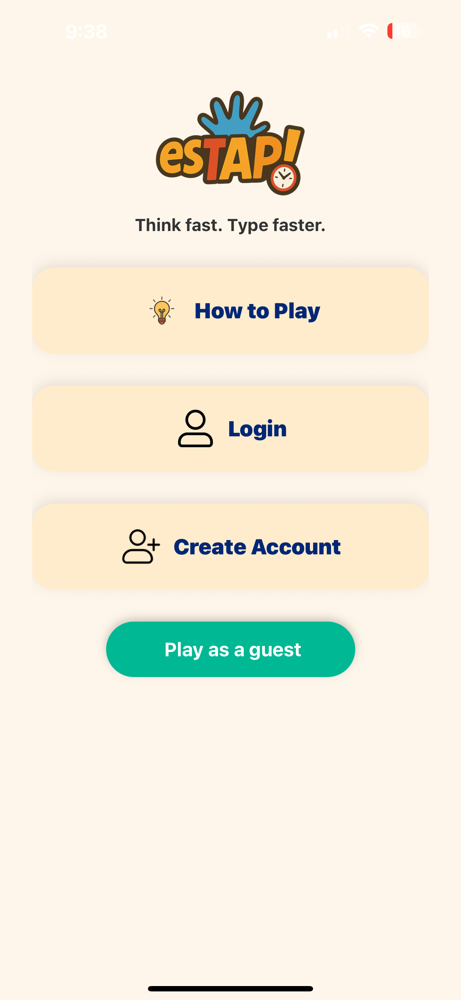
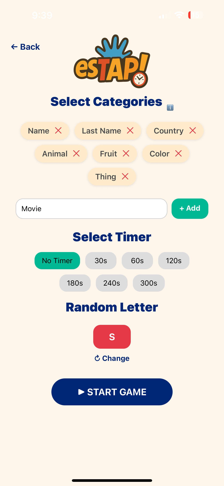
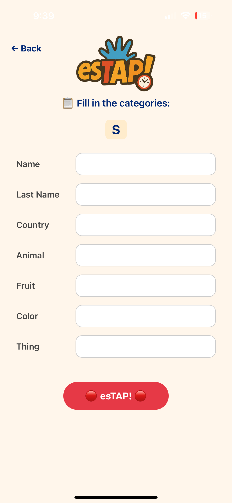

# esTAP! – Multiplayer Word Game App 🎮

**Status:** In Progress  
**Built With:** React Native · Expo Go · Firebase · JavaScript  

## 📱 What is esTAP?

esTAP is a mobile game app version of the classic STOP word game. Players race against the clock to list words starting with a random letter under categories like names, cities, and food!

## 🔧 Features

- 🏁 Game lobby with category and timer setup
- 🔡 Random letter generator
- 📝 Game screen with input validation
- 🔐 Firebase Authentication
- ☁️ Real-time database with Firestore
- 🔄 Built with Expo Go for quick testing and development

## 🛠️ Tech Stack

- React Native
- Firebase (Auth & Firestore)
- Expo Go
- JavaScript
- VS Code

## 📌 Coming Soon

- Multiplayer support with synced rounds
- Results screen and scoring
- Leaderboard system

# esTAP! – Multiplayer Word Game App 🎮

React Native • Firebase • Expo Go

## 📸 Screenshots

### Welcome Screen

### Game Lobby

### Game Screen

## 🔗 Try It on Your Phone

Scan the QR code with the **Expo Go** app:

## 👩‍💻 Made by Jhosmeily Hernandez
